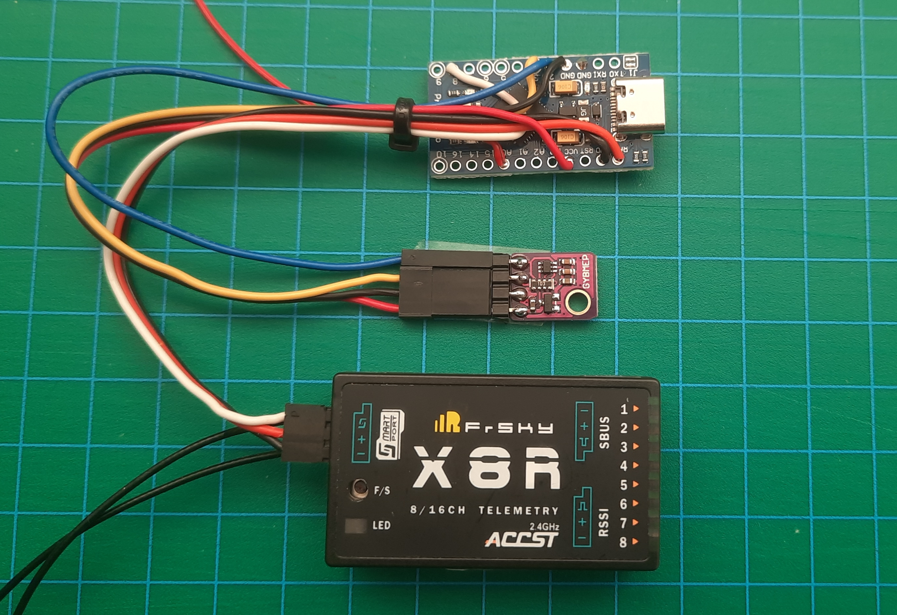

# Welcome to OpenSPortSensor
Telemetry for *FrSky* RC Receivers using the **SPort** interface.

The main goals for this project were:
- Provide a software easy to adapt for your own sensors by implementing a simple interface
- Support different *Arduino* boards by using high level libraries for communication only
- Support Hardware- and Software-Serial interfaces
- Supply a set of standard sensors for e.g. voltage and current measurement

The Documentation for this project can be found in the [wiki](https://github.com/icebreaker-ch/OpenSPortSensor/wiki)

  <table>
    <tr>
      <td align="center">
        <figure>
           
          <figcaption>First Prototype with Voltage measuring and Vario sensor</figcaption>
        </figure>
      </td>
      <td align="center">
        <figure>
           
          <figcaption>Arduino Pro Micro</figcaption>
        </figure>
        </td>
    </tr>
    <tr>
      <td align="center">
        <figure>
           
          <figcaption>OpenSPort Sensor with current and voltage sensors in a <i>Great Planes</i> <i>Mister Mulligan<i></figcaption>
        </figure>
      </td>
    \/tr>
  </table>

[Wiring of the prototype (PDF)](https://github.com/icebreaker-ch/OpenSPortSensor/blob/main/images/ExampleConfiguration.pdf) with Voltage and Vario Sensor, using a BME280.
